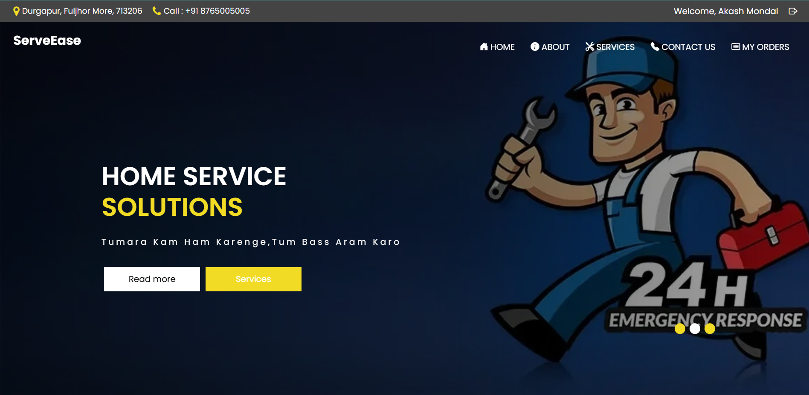

# ServeEase: Home Service Management Application

## Introduction
ServeEase is a comprehensive platform that simplifies the management of home services. It connects users with skilled professionals, offering a wide range of services like cleaning, maintenance, and repairs. The application is built using PHP, HTML, CSS, JavaScript, and MySQL.

---

## Table of Contents

1. [Features](#features)
2. [Technologies Used](#technologies-used)
3. [Installation Guide](#installation-guide)
4. [Database Setup](#database-setup)
5. [Usage](#usage)
6. [Screenshots](#screenshots)
7. [Contributing](#contributing)
8. [License](#license)
9. [Contact](#contact)

---

## Features
- User authentication and role-based access control (Admin, Customer, and Service Provider).
- Service booking and management.
- Real-time notifications for bookings and updates.
- Feedback system for reviewing services.
- Comprehensive admin dashboard for service and user management.

---

## Technologies Used
- Frontend: HTML, CSS, JavaScript, Bootstrap
- Backend: PHP
- Database: MySQL
- Additional Libraries: jQuery, Bootstrap Icons

---

## Installation Guide

1. Clone the repository:
   ```bash
   git clone https://github.com/tusharbhandarii/College_minor_project.git
   ```

2. Set up a local server (XAMPP/WAMP/MAMP):
   - Place the project folder in the `htdocs` directory (for XAMPP).

3. Start Apache and MySQL in the XAMPP Control Panel.

4. Navigate to `http://localhost/College_minor_project` in your browser.

---

## Database Setup

1. Open phpMyAdmin (`http://localhost/phpmyadmin`).
2. Create a database named `demoproject`.
3. Import the SQL file located at `database/demoproject.sql`.

---

## Usage

1. Navigate to the project URL in your browser (`http://localhost/College_minor_project`).
2. Register as a user or log in with admin credentials for dashboard access.
3. Explore services, book appointments, and manage feedback.

---

## Screenshots

1. **Homepage**
   

3. **Admin Dashboard**
   

4. **Service Booking**
   

---

## Contributing

We welcome contributions to enhance ServeEase. To contribute:

1. Fork the repository.
2. Create a new branch:
   ```bash
   git checkout -b feature-branch-name
   ```
3. Commit your changes:
   ```bash
   git commit -m "Your commit message"
   ```
4. Push to the branch:
   ```bash
   git push origin feature-branch-name
   ```
5. Open a Pull Request.

---

## License

This project is licensed under the MIT License. See the LICENSE file for details.

---

## Contact

For any inquiries or feedback, please reach out to:

- **Name:** Tushar Bhandari
- **Email:** bhandari15157@gmail.com
- **GitHub:** [tusharbhandarii](https://github.com/tusharbhandarii)

---

Thank you for checking out ServeEase!
